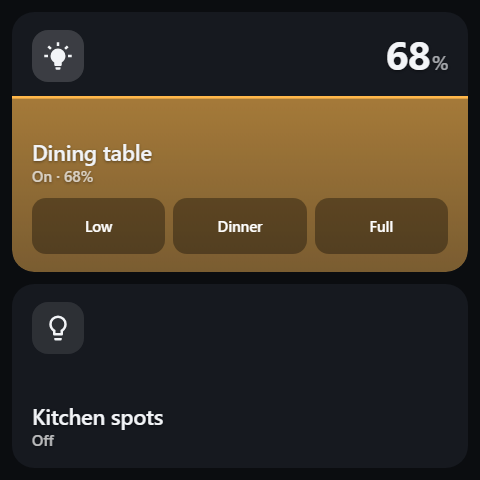
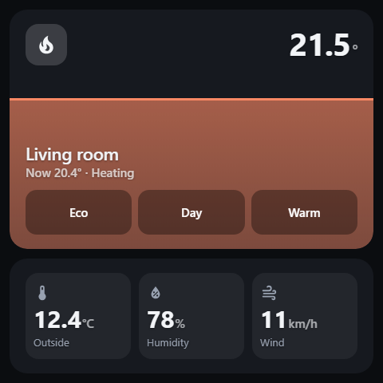
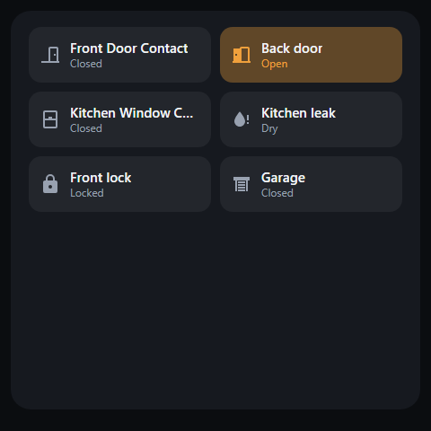
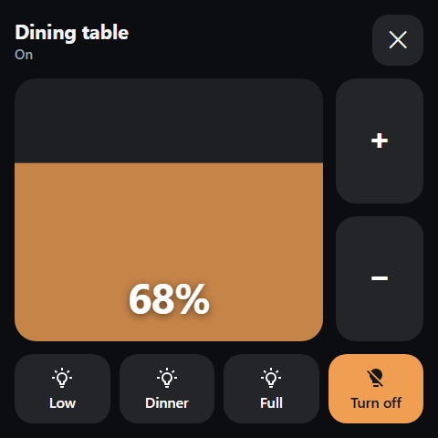
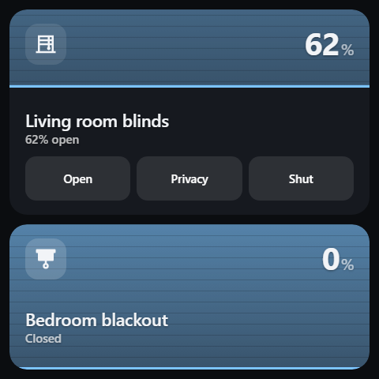
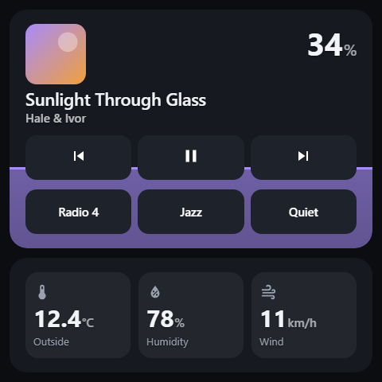
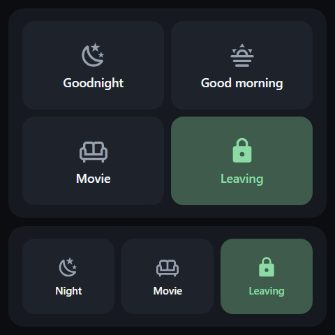
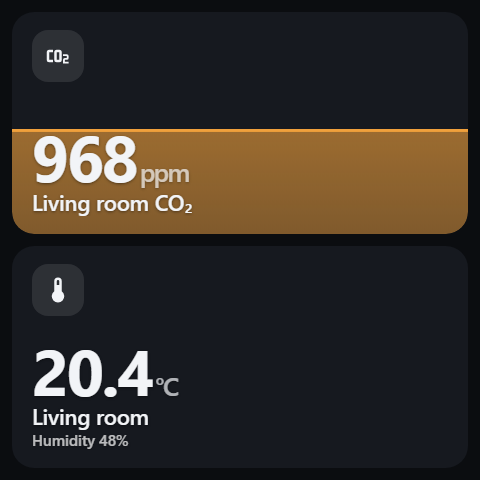
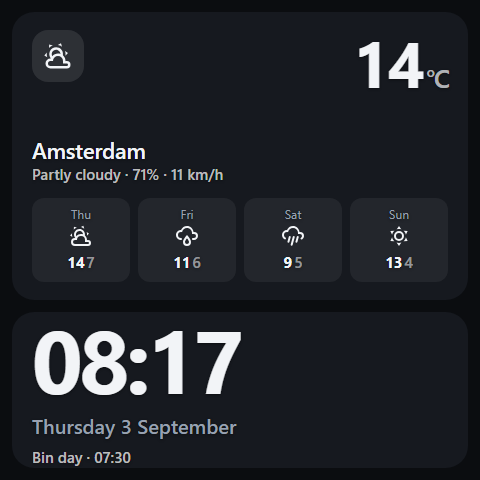

# NSPanel Cards

Lovelace cards built for one specific piece of hardware: the **Sonoff NSPanel Pro 86** — the
3.95″ 480×480 square wall panel.

The panel runs a Rockchip PX30 with 2 GB of RAM and a Mali-G31, behind Android 8.1. That is
2018-class silicon. The usual card packs are built for phones, and on this hardware their
sliders lag, their hitboxes are small and their text is tiny. Everything here is shaped by
the constraint.

<table>
<tr>
<td></td>
<td></td>
<td></td>
</tr>
<tr>
<td align="center"><sub>Lights</sub></td>
<td align="center"><sub>Climate</sub></td>
<td align="center"><sub>Status</sub></td>
</tr>
</table>

<sub>Rendered from `dist/nspanel-cards.js` at the panel's own 480×480, by
[`dev/bench.html`](dev/bench.html) — not mockups.</sub>

## Cards

**Controls** — drag to set, tap to act, long-press for the full-screen surface:

| Card | What it does |
| --- | --- |
| `custom:nspanel-light-card` | Brightness. Drag anywhere, tap to toggle, long-press for the full-screen control. The fill takes the bulb's own colour. |
| `custom:nspanel-cover-card` | Blind/cover position. Same gestures; a tap while it is moving **stops** it. |
| `custom:nspanel-climate-card` | Target temperature. Drag to set it, long-press for HVAC modes. Tap opens more-info rather than toggling — turning the heating off by brushing past the panel is a bad afternoon. |
| `custom:nspanel-media-card` | Media player. Drag for volume, tap to play/pause, transport buttons on the face. |

**Actions** — fire and forget:

| Card | What it does |
| --- | --- |
| `custom:nspanel-button-card` | Scenes, scripts, automations. One big button, or up to six in a 1–3 column grid. Tells you the tap landed, and can ask twice before doing something drastic. |

**Information** — read-only, tap opens Home Assistant's own more-info dialog:

| Card | What it does |
| --- | --- |
| `custom:nspanel-sensor-card` | One reading, at 64px. Optional range bar and severity colours. |
| `custom:nspanel-sensors-card` | Two to four readings side by side, for a page that has to earn its space. |
| `custom:nspanel-status-card` | Doors, windows, locks, leaks. Quiet when all is well; with `only_problems` the usual state of the card is empty. |
| `custom:nspanel-weather-card` | Current conditions and a short forecast. |
| `custom:nspanel-clock-card` | Time, date, and an optional line from any entity. For the page a panel idles on. |
| `custom:nspanel-probe-card` | Diagnostics. Prints viewport, devicePixelRatio, WebView version and CSS feature support, read straight off the glass. |

## Gestures

| | |
| --- | --- |
| **Tap** | Toggle. On a moving cover, stop. |
| **Drag up / down** | Adjust, relative to the current value. The full card height is the full range. |
| **Long-press** (500 ms) | Full-screen control: an absolute slider, big ± steps, preset and action buttons. |
| **Drag sideways** | Released back to the page, so a swipe card still changes page. |



Gestures apply to the control cards. The information cards are read-only: a tap opens HA's
more-info dialog, which is where history and settings already live.

## Why it isn't laggy

- **No service calls during a drag.** The card moves a block with `translate3d` and the CSS
  transition switched off, so the fill tracks your finger on the compositor. One call goes out
  when you let go. (`live: true` if you want throttled mid-drag updates.)
- **State can't yank the value back.** After a change the card ignores incoming state for
  `echo_ms` (1.5 s), so a slow round-trip can't make the slider jump backwards under your hand.
- **`hass` updates are diffed to one entity.** Home Assistant hands every card a fresh `hass`
  object whenever anything in the house changes; these cards compare the single state object
  they care about and return immediately otherwise.
- **Nothing expensive is animated.** Only `transform` and `opacity`. No `backdrop-filter`, no
  animated shadows, no continuous animation — the classic Mali-G31 killers.
- **The DOM is built once.** Updates touch custom properties and `textContent`, never `innerHTML`.
- **No framework, no dependencies.** Plain custom elements. The whole bundle is one file.

Browser baseline is **Chromium 108**, the minimum the HA Companion app needs on Android 8.1.
That rules out `color-mix()` and CSS nesting; neither is used.

## Install

### HACS (custom repository)

1. HACS → ⋮ → **Custom repositories**
2. URL: `https://github.com/mennovanhout/nspanel-cards`, category **Dashboard**
3. Install, then add the resource if HACS doesn't:
   `/hacsfiles/nspanel-cards/nspanel-cards.js`, type **JavaScript module**

### Manual

1. Copy `dist/nspanel-cards.js` to `/config/www/nspanel-cards.js`
2. Settings → Dashboards → ⋮ → Resources → `/local/nspanel-cards.js?v=0.6.0`, type
   **JavaScript module**

Home Assistant caches `/local/` hard. Bump the `?v=` when you update, or you will be looking at
the old file and wondering why nothing changed.

## Configuration

Both the light and cover cards have a **visual editor** — add one from the dashboard's card
picker, or click the pencil on an existing card, and you get HA's own controls: entity picker,
icon picker, switches, the lot. Everything in the shared options table below is in there.

`presets` is the one exception. It is a list of objects and HA's form builder has no control
for that, so presets stay in YAML — the editor leaves the key untouched, so opening the GUI on
a card with hand-written presets will not eat them. (The probe card has no options and no
editor.)

### Light

<table>
<tr>
<td valign="top">

```yaml
type: custom:nspanel-light-card
entity: light.dining_lights
title: Dining table
height: 260
presets:
  - name: Low
    brightness_pct: 15
  - name: Dinner
    brightness_pct: 45
    color_temp_kelvin: 2400
  - name: Full
    brightness_pct: 100
```

</td>
<td></td>
</tr>
</table>

That is the card at the top of the picture; below it is a second one with
`show_presets: false` and `height: 184`.

#### The card takes the light's colour

The fill is the bulb's own colour, not a fixed accent. The top card in the picture is a 2700K
warm white; the one below it is a colour lamp sitting on purple. Nothing to configure — Home
Assistant reports `rgb_color` for colour-temperature lights as well as colour ones, computed
from the kelvin, so a warm lamp tints the card warm on its own. A brightness-only or on/off
light reports no colour and keeps the amber default.

Bulb colours are not chosen to have text on them, though, and raw ones break the card at both
ends: a white or pale light washes the fill out until the label disappears into it, and a
saturated blue is so dark it vanishes against the card instead. So the colour is pulled into a
usable luminance band before it is used — scaled down when too bright, mixed toward white when
too dark. The hue survives, which is the part that matters: a blue lamp still reads blue.

Setting `accent` explicitly turns this off for that card — if you picked a colour, the card
does not argue — and `follow_color: false` turns it off while leaving the default amber.

| Option | Default | |
| --- | --- | --- |
| `follow_color` | `true` | use the bulb's colour for the fill, the level line and the sheet |

A preset takes any of `brightness_pct`, `color_temp_kelvin`, `rgb_color`, `effect`, or `scene`
(to fire a scene instead). `brightness_pct: 0` turns the light off.

### Cover

<table>
<tr>
<td valign="top">

```yaml
type: custom:nspanel-cover-card
entity: cover.blinds_living_room
title: Living room blinds
height: 260
presets:
  - name: Open
    position: 100
  - name: Privacy
    position: 35
  - name: Shut
    position: 0
```

</td>
<td></td>
</tr>
</table>

The fill descends from the top, the way a blind actually does: at 62% open it
covers the top 38% of the card.

Falls back to `open_cover` / `close_cover` when the entity doesn't advertise `SET_POSITION`.

### Climate

<table>
<tr>
<td valign="top">

```yaml
type: custom:nspanel-climate-card
entity: climate.living_room
title: Living room
height: 300
presets:
  - name: Eco
    temperature: 17
  - name: Day
    temperature: 20.5
  - name: Warm
    temperature: 22
```

</td>
<td></td>
</tr>
</table>

The drag range is the thermostat's own `min_temp`/`max_temp` unless you narrow it with `min`
and `max` — worth doing, because 7–35 makes every drag a wild one. `step` defaults to `0.5`
here rather than the `5` the percentage cards use. The long-press sheet lists whichever
`hvac_modes` the entity advertises. A preset takes `temperature`, `hvac_mode`, `preset_mode`,
or any combination.

The strip under the card in that picture is a `nspanel-sensors-card`; the whole page is
in [the panel view example](#a-full-480480-panel-view) below.

### Media

<table>
<tr>
<td valign="top">

```yaml
type: custom:nspanel-media-card
entity: media_player.kitchen
title: Kitchen
height: 300
presets:
  - name: Radio 4
    source: BBC Radio 4
  - name: Jazz
    source: Jazz24
  - name: Quiet
    volume_pct: 15
```

</td>
<td></td>
</tr>
</table>

The card fill is **volume**, so the drag gesture that dims a light sets the volume here, and
the long-press sheet gives you an absolute slider with the same transport buttons. Tap is
play/pause; set `more_info: true` if you would rather it opened the dialog.

Presets on this card are **favourites**, not levels. Each takes a `source` (calls
`select_source`), a `media_content_id` with optional `media_content_type` (calls `play_media`),
a `volume_pct`, or a combination. There are none by default — the transport row is what most
panels want, and showing both rows needs about 300px.

Buttons grey themselves out when the player does not advertise the feature, and the whole card
degrades quietly: no `VOLUME_SET` and the fill still tracks your finger, it just does not send
anything.

Album art is the one thing in this bundle that decodes a bitmap. It is held to a fixed 76px
box, and the `src` is only assigned when the URL actually changes — reassigning the same `src`
makes the browser decode it again, and on a media card a render happens on every volume tick.
`show_art: false` drops it for the domain icon.

| Option | Default | |
| --- | --- | --- |
| `show_art` | `true` | album art, else the domain icon |
| `show_transport` | `true` | previous / play-pause / next |
| `more_info` | `false` | `true` makes tap open the dialog instead of play/pause |
| `presets` | none | favourites: `source`, `media_content_id`, `volume_pct` |

### Buttons

<table>
<tr>
<td valign="top">

```yaml
type: custom:nspanel-button-card
height: 300
columns: 2
buttons:
  - entity: script.goodnight
    name: Goodnight
    icon: mdi:weather-night
    confirm: true
  - entity: script.good_morning
    name: Good morning
    icon: mdi:weather-sunset
  - entity: scene.movie
    name: Movie
    icon: mdi:sofa-outline
  - entity: script.leaving
    name: Leaving
    icon: mdi:lock
```

</td>
<td></td>
</tr>
</table>

For one button, skip the list:

```yaml
type: custom:nspanel-button-card
entity: script.goodnight
title: Goodnight
icon: mdi:weather-night
height: 144
```

A single button always takes the whole card. Otherwise `columns` puts 1, 2 or 3 across — the
lower card in the picture is `columns: 3`. Six buttons is the cap; more than that on a 480px
panel is a list of things you cannot read, let alone hit.

**Every other card here reflects a state. These do not.** You press "Goodnight", the house
does fifteen things over the next minute, and the entity you pressed looks exactly as it did
before — so the card has to supply the acknowledgement itself. It does: the press scales the
button, a haptic fires, and the button holds an accent tick for `feedback_ms` (1.2s). A script
that reports `on` while it runs keeps the accent for as long as it is running, which is the
green button in the picture.

The other half of that problem is misfires. "Goodnight" at four in the afternoon is a
genuinely annoying thing to do to a household, and a wall panel is exactly what people brush
past. `confirm: true` makes a button ask for a second tap within three seconds, and say so
while it waits.

The service is worked out from the entity's domain — `script.turn_on`, `scene.turn_on`,
`automation.trigger`, `button.press`, `input_button.press`, `vacuum.start`, and
`homeassistant.toggle` for anything else, which covers lights, switches and input booleans.
Override it per button with `service:` and optional `data:`, with or without an entity:

```yaml
buttons:
  - name: Ping my phone
    service: notify.mobile_app_pixel
    data:
      message: The panel says hello
```

A long-press on a button opens more-info for its entity, which is where you go to find out why
the scene did not do what you expected.

| Option | Default | |
| --- | --- | --- |
| `buttons` | — | up to 6; `entity` alone is the one-button shorthand |
| `columns` | `2` | 1–3; a single button always fills the card |
| `confirm` | `false` | ask for a second tap; also settable per button |
| `confirm_text` | `Tap again` | shown while it waits |
| `feedback_ms` | `1200` | how long the tick holds |
| `haptics` | `true` | |
| `more_info` | `true` | long-press opens the dialog |

Per button: `entity`, `name`, `icon`, `service`, `data`, `confirm`, `confirm_text`.

### Sensor

<table>
<tr>
<td valign="top">

```yaml
type: custom:nspanel-sensor-card
entity: sensor.living_co2
title: Living room CO₂
height: 222
min: 400
max: 1600
severity:
  - above: 800
    color: '#f0a03c'
  - above: 1200
    color: '#f87171'
```

</td>
<td></td>
</tr>
</table>

`min` and `max` turn the card into a bar; without both, it is just the number. `severity`
recolours it — the last matching `above` wins, so the list reads the way you would say it.
`secondary` puts a second entity on the line underneath, which is the lower card in the
picture:

```yaml
type: custom:nspanel-sensor-card
entity: sensor.living_temp
title: Living room
secondary: sensor.living_hum
height: 222
```

| Option | Default | |
| --- | --- | --- |
| `min` / `max` | — | both needed for the bar |
| `bar` | on when `min` and `max` are set | `false` forces it off |
| `severity` | — | `[{above, color}]`, last match wins |
| `secondary` | — | an entity for the line underneath |
| `unit` | the entity's own | `''` to hide it |
| `decimals` | 1 below 100, 0 above | |

### Sensors

```yaml
type: custom:nspanel-sensors-card
title: Outside
height: 144
entities:
  - entity: sensor.outside_temp
    name: Outside
  - entity: sensor.outside_hum
    name: Humidity
  - entity: sensor.wind
    name: Wind
```

Two to four entities; a fifth is ignored rather than squeezed in. An entry is either a bare
`sensor.x` or a map taking `entity`, `name`, `icon`, `unit` and `decimals`. `show_icons: false`
drops the icons and gives the numbers the room.

### Status

<table>
<tr>
<td valign="top">

```yaml
type: custom:nspanel-status-card
title: House
height: 444
only_problems: false
entities:
  - binary_sensor.front_door
  - entity: binary_sensor.back_door
    name: Back door
  - binary_sensor.kitchen_window
  - entity: binary_sensor.leak_kitchen
    name: Kitchen leak
  - entity: lock.front_door
    name: Front lock
  - entity: cover.garage
    name: Garage
```

</td>
<td></td>
</tr>
</table>

What counts as a problem is the obvious thing per domain: a `binary_sensor` that is `on`, a
`lock` that is `unlocked`, a `cover` that is `open`, a `person` that is `not_home`. An entity
that is missing, `unavailable` or `unknown` counts too — a sensor that stopped reporting is
exactly the thing you want a wall panel to tell you about. Override it per entity with
`problem_when: [state, ...]`.

With `only_problems: true` the card shows nothing but what is wrong, and an all-clear when
there is nothing — which makes it the fastest card on the panel to read. `columns` takes 1, 2
or 3 across, the same as the button card; `all_clear` sets the text.

### Weather

<table>
<tr>
<td valign="top">

```yaml
type: custom:nspanel-weather-card
entity: weather.home
title: Amsterdam
height: 288
forecast_type: daily
forecast_count: 4
```

</td>
<td></td>
</tr>
</table>

Since Home Assistant 2024.4 a forecast is a websocket subscription rather than an attribute,
so the card subscribes itself and drops the subscription when it leaves the DOM. On a core old
enough not to have that command it falls back to the entity's `forecast` attribute. Set
`show_forecast: false` for current conditions only.

### Clock

```yaml
type: custom:nspanel-clock-card
height: 156
hour_24: true
show_date: true
entity: calendar.family
```

No entity required. If you give it one, its state — or its `message` attribute, which is what
a calendar puts the event title in — becomes the line under the date. That is the lower card
in the weather picture above. `show_seconds: true` re-arms the timer every second instead of
every minute; the panel can take it, but it is one more thing running.

### Shared options

| Option | Default | |
| --- | --- | --- |
| `entity` | — | required |
| `title` | the entity's friendly name | what the card calls it |
| `name` | — | the older spelling of `title`; still works |
| `icon` | domain default | |
| `height` | `200` | card height in px |
| `accent` | amber / sky | any hex |
| `presets` | 3 sensible ones | max 4 shown on the card |
| `show_presets` | `true` | |
| `live` | `false` | send updates mid-drag, throttled to 400 ms |
| `echo_ms` | `1500` | ignore incoming state for this long after a change |
| `drag_travel` | card height | px of travel for the full range |
| `swipe_safe` | `true` | give horizontal drags back to the page |
| `long_press` | `sheet` | or `none` |
| `long_press_ms` | `500` | |
| `step` | `5` | the ± buttons in the full-screen control |
| `haptics` | `true` | fires HA's `haptic` event |
| `more_info` | `true` | tap opens HA's more-info dialog (information cards, and the climate card) |

The drag, preset and long-press options apply to the control cards. The information cards take
`entity`/`entities`, `title`, `icon`, `height`, `accent` and `more_info`, plus whatever is
listed in their own section above.

### A full 480×480 panel view

```yaml
kiosk_mode:
  hide_header: true
views:
  - type: panel
    cards:
      - type: custom:simple-swipe-card
        card_spacing: 12
        cards:
          - type: vertical-stack
            cards:
              - type: custom:nspanel-light-card
                entity: light.dining_lights
                title: Dining table
                height: 260
              - type: custom:nspanel-light-card
                entity: light.lounge_lamp
                title: Lounge lamp
                height: 184
                show_presets: false
          - type: vertical-stack
            cards:
              - type: custom:nspanel-cover-card
                entity: cover.blinds_living_room
                title: Living room blinds
                height: 260
              - type: custom:nspanel-cover-card
                entity: cover.bedroom_blackout
                title: Bedroom blackout
                height: 184
                show_presets: false
```

An information page for the same panel:

```yaml
- type: vertical-stack
  cards:
    - type: custom:nspanel-climate-card
      entity: climate.living_room
      title: Living room
      height: 300
    - type: custom:nspanel-sensors-card
      title: Outside
      height: 144
      entities:
        - entity: sensor.outside_temp
          name: Outside
        - entity: sensor.outside_hum
          name: Humidity
        - entity: sensor.wind
          name: Wind
```

300 + 144 + the 12px gap fills a 480px panel exactly, the same way 260 + 184 does.

## There is also a native app

If the panel is still laggy with the frontend out of the way, the WebView itself is the
ceiling. [nspanel-app](../nspanel-app) is a Flutter app that renders these same cards
natively - it reads your Lovelace dashboard over the websocket, so the YAML in this README is
the one config for both. Measured on the panel, it is not close.

## Running it without the Home Assistant frontend

These cards are careful with the panel's frame budget, but they are passengers. Open a
dashboard in the companion app and the WebView is also running the whole HA frontend: Lit, the
entity registry, the view tree, the theme system. On a PX30 that is most of the cost, and no
amount of card tuning touches it.

`kiosk/` is the experiment that isolates it — the same cards, a websocket to Home Assistant,
and nothing else:

```
kiosk/index.html   the page
kiosk/app.js       websocket, pager, setup screen
kiosk/config.js    your pages and cards - yours to edit, never overwritten
kiosk/icons.js     <ha-icon> for pages that are not HA
```

It works because the cards' entire dependency on Home Assistant is `hass.states` and
`hass.callService` (plus `hass.connection.subscribeMessage`, for the weather forecast). That is
a small enough surface to reimplement in a few hundred lines.

**Install it:** copy `dist/` and `kiosk/` into `/config/www/nspanel/`, then open
`http://<your-ha>:8123/local/nspanel/kiosk/index.html` **on the panel** — the whole point is to
measure that WebView on that GPU, so a desktop browser will tell you nothing.

First run asks for your Home Assistant URL and a long-lived access token (profile → Security
→ bottom of the page). The token is kept in that panel's `localStorage`. **Do not put it in
`config.js`**: `/local/` is served without authentication, so a token in a file there is
readable by anything on your network. Triple-tap the top-left corner to get the setup screen
back.

### Pages

`config.js` is a list of pages; each page is a vertical stack of cards, using the same configs
as the rest of this README (the `custom:` prefix is optional, so Lovelace card YAML converts
straight across). Swipe sideways to change page.

The pager is a native scroll-snap container, not a gesture handler. It does not have to be:
the cards already declare `touch-action: pan-x` and hand any horizontal-first drag straight
back — the same cooperation that makes them work inside a swipe card — so the browser pans on
the compositor and no script runs during a swipe at all.

### Two query flags

- `?stats=1` puts a frame counter in the corner. This page exists to answer "is it smooth", so
  measure rather than squint.
- `?mock=1` swaps in a fake Home Assistant (`dev/kiosk-mock.js`) that speaks the same websocket
  protocol, so you can try the page, and develop against it, without a real instance. Service
  calls mutate the fake house and echo back, so the round trip is real.

This is **experimental**, and deliberately not what HACS installs. It renders only these cards,
has no more-info dialog, and knows nothing about the rest of Home Assistant.

## Sizing for your panel

The panel is 480 physical pixels, but Android density decides how many **CSS** pixels the page
gets. Stock is often not 160 dpi, and the community fix is `adb shell wm density 148` (with
kiosk-mode) or `133` (without) — which hands the page ~519 or ~577 CSS px instead of 480.

Drop `custom:nspanel-probe-card` on a dashboard once and read the real numbers off the glass,
then set `height` to suit. Delete it afterwards; it is a tool, not furniture.

## Licence

MIT
